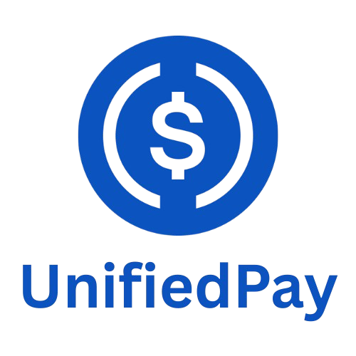

# UnifiedPay

<div align="center">
  
  
  <h3>One USDC Liquidity Surface. Powered by Arc Network.</h3>
  
  <p>
    <a href="https://unifiedpay.birangal.com/">🌐 Live Demo</a> •
    <a href="https://github.com/AdityaBirangal/UnifiedPay">📦 GitHub</a> 
  </p>
</div>

---

## 📖 Project Overview

**UnifiedPay treats all USDC across chains as one unified liquidity surface.**

UnifiedPay enables creators to accept USDC payments on **Arc Network** as the primary settlement layer, while giving users visibility into their **unified USDC balance across 15+ chains** via **Circle Gateway**. Payments are made to human-readable **ENS names** (`creator.eth`) instead of hex addresses, with dynamic ENS resolution at runtime.

The result: **A non-custodial payment experience where users pay on Arc, creators receive on Arc, and the complexity of multi-chain USDC management is abstracted away.**

### The Problem

Traditional Web3 payment platforms fragment liquidity across chains. A creator might accept payments on Ethereum, Polygon, and Base — but this creates:
- **Fragmented balances** that require manual reconciliation
- **Poor UX** — users must switch chains or bridge assets
- **Hex address fatigue** — sharing `0x1234...` instead of human names

### The Solution

UnifiedPay uses:
1. **Arc Network** as the single settlement and coordination layer
2. **Circle Gateway** for unified USDC balance visibility across 15+ chains
3. **ENS** for human-readable payment identities

Users see their total USDC across all chains, pay on Arc, and creators receive instantly on Arc — all without bridging, swapping, or managing multiple chain UIs.

---

## 🌐 Why Arc Network?

**Arc serves as the coordination and settlement layer for UnifiedPay.**

While users may hold USDC on Ethereum, Base, Arbitrum, or other chains (visible via Circle Gateway), **all payments settle on Arc**. This design:

- ✅ **Avoids fragmenting liquidity** — One settlement layer, not N chains
- ✅ **Provides fast, low-cost settlement** — Creators receive payments instantly
- ✅ **Uses Arc as single source of truth** — Payment state lives on Arc
- ✅ **Eliminates bridge UX** — No manual chain switching or asset transfers

Arc is not just "another chain" — it's the **unified settlement surface** for cross-chain USDC liquidity.

### Arc's Role in the Payment Flow

```
1. User sees unified USDC balance (via Circle Gateway)
2. User pays with USDC on Arc Network
3. Payment settles on Arc (coordination layer)
4. Creator receives USDC on Arc (single chain, instant)
```

By using Arc as the settlement layer, UnifiedPay demonstrates how **multiple chains can share one liquidity surface** without fragmenting user experience.

---

## 💰 Circle Gateway Integration

**Circle Gateway provides unified USDC balance visibility.**

UnifiedPay integrates Circle Gateway's **balance aggregation API** to show users their total USDC across **15+ chains** in one unified view:

- Ethereum
- Base
- Arbitrum
- Optimism
- Polygon
- Avalanche
- Solana
- Unichain
- Sonic
- World Chain
- HyperEVM
- Sei
- **Arc Network**
- ...and more

### What Circle Gateway Does (and Doesn't Do)

✅ **What it does:**
- Aggregates USDC balances across all chains into one unified number
- Provides real-time balance visibility via Circle's API
- Helps users answer: *"Do I have enough USDC across my wallets to make this payment?"*

❌ **What it doesn't do:**
- Does NOT automatically bridge or swap assets
- Does NOT custody user funds
- Does NOT execute cross-chain transfers

**This is balance reconciliation, not bridging.** Users see their total USDC liquidity surface, then pay with USDC on Arc.

### Implementation Details

- Uses Circle Gateway REST API (`/v1/balances`)
- Read-only integration (no write operations)
- Falls back to direct RPC queries if Circle Gateway is unavailable
- Supports both testnet and mainnet environments

Code reference: `lib/circle-gateway.ts`

---

## 🔗 ENS Integration

**ENS provides human-readable payment identities.**

Instead of sharing payment links like `unifiedpay.com/pay/0x1234...`, creators can use **ENS names** like:

```
unifiedpay.com/pay/creator.eth ✓
```

### What UnifiedPay Implements

✅ **Runtime ENS resolution** (forward and reverse)
- Forward: `creator.eth` → `0x1234...`
- Reverse: `0x1234...` → `creator.eth`

✅ **ENS avatar display** from on-chain records
- Fetches and displays ENS avatars via `resolver.getAvatar()`

✅ **Dynamic lookups** — No hardcoded addresses
- All ENS resolution happens at runtime via ethers.js ENS API
- Uses Ethereum Sepolia testnet for ENS lookups

### Why This Matters

ENS is not cosmetic — it's the **identity layer** for payments:
- **Better UX**: Share `creator.eth` instead of `0x1234...`
- **On-chain verification**: ENS names resolve to addresses trustlessly
- **Portable identity**: ENS names work across all chains

### Implementation Details

- Uses ethers.js `provider.resolveName()` and `provider.lookupAddress()`
- Implements 5-minute in-memory cache for performance
- Gracefully falls back to hex addresses if ENS resolution fails
- Supports ENS avatars from IPFS, HTTP, and data URIs

Code reference: `lib/ens.ts`

**For detailed ENS implementation documentation**, see [ENS_INTEGRATION.md](./memory-bank/ENS_INTEGRATION.md)

---

## 🏗️ Architecture Overview

### System Flow

```
┌─────────────────────────────────────────────────────────────┐
│  User Wallet                                                 │
│  (USDC on multiple chains: Ethereum, Base, Arbitrum, etc.)  │
└─────────────────────┬───────────────────────────────────────┘
                      │
                      ▼
         ┌────────────────────────┐
         │   Circle Gateway API   │
         │  (Balance Aggregation) │
         └────────────┬───────────┘
                      │
                      ▼
         ┌────────────────────────┐
         │  UnifiedPay Frontend   │
         │  - ENS Resolution      │
         │  - Payment UI          │
         └────────────┬───────────┘
                      │
                      ▼
         ┌────────────────────────┐
         │     Arc Network        │
         │  (Settlement Layer)    │
         │  - USDC Transfer       │
         │  - Payment Recording   │
         └────────────┬───────────┘
                      │
                      ▼
         ┌────────────────────────┐
         │   Creator Wallet       │
         │  (Receives on Arc)     │
         └────────────────────────┘
```

### Key Components

1. **Circle Gateway** — Read-only balance visibility across 15+ chains
2. **Arc Network** — Settlement and coordination layer for payments
3. **ENS** — Human-readable identity resolution
4. **UnifiedPay** — Frontend + API that orchestrates all three

### Technical Architecture

- **Frontend**: Next.js 16 (App Router), React 18, Tailwind CSS
- **Wallet Connection**: thirdweb WalletConnect
- **Blockchain Interaction**: ethers.js
- **Database**: PostgreSQL (Supabase) + Prisma ORM
- **Payment Settlement**: Arc Network USDC contracts
- **Balance Aggregation**: Circle Gateway REST API
- **Identity Resolution**: ENS via ethers.js on Sepolia

---

## ✅ What's Implemented vs ❌ What's Not

### ✅ Implemented Features

- **Arc Network Integration**
  - USDC payment settlement on Arc
  - Arc as primary coordination layer
  - Direct Arc Network RPC integration

- **Circle Gateway Integration**
  - Unified USDC balance across 15+ chains
  - Real-time balance aggregation via Circle API
  - Fallback to direct RPC queries

- **ENS Integration**
  - Runtime ENS name resolution (forward + reverse)
  - ENS avatar display from on-chain records
  - Dynamic lookups via ethers.js
  - Human-readable payment URLs (`/pay/creator.eth`)

- **Payment Infrastructure**
  - Non-custodial direct wallet-to-wallet transfers
  - Zero platform fees (100% to creators)
  - Automatic content unlocking after payment
  - Payment history and analytics dashboard

- **User Experience**
  - Single-page payment flow
  - No chain switching required
  - ENS-based identity throughout UI

### ❌ Not Implemented

- **Automatic cross-chain bridging** — Users pay on Arc (no bridge UI)
- **Token swaps** — USDC-only (no DEX integration)
- **Custodial wallets** — Fully non-custodial (users control keys)
- **Fiat on/off ramps** — Crypto-native only

---

## 🏗️ Integration Highlights

### Arc Network Integration ✓

| Feature | Implementation |
|---------|----------------|
| **Uses Arc as coordination layer** | All payments settle on Arc; Arc is the single source of truth for payment state |
| **Demonstrates multi-chain UX** | Circle Gateway shows balances across 15+ chains; users pay on Arc without chain switching |
| **Shows Arc's unique value** | Arc enables "one liquidity surface" by serving as the settlement layer for cross-chain USDC |
| **Technical implementation** | Direct Arc Network integration via RPC; USDC transfers on Arc; payment recording on Arc |

**Why this matters for Arc**: UnifiedPay demonstrates how Arc can serve as a **coordination layer** that unifies fragmented multi-chain liquidity into one settlement surface.

---

### ENS Integration ✓

| Feature | Implementation |
|---------|----------------|
| **Runtime ENS resolution** | Uses ethers.js `resolveName()` and `lookupAddress()` — no hardcoded addresses |
| **Human-readable identities** | Payment URLs use ENS names (`/pay/creator.eth`) instead of hex addresses |
| **ENS avatar integration** | Displays ENS avatars from on-chain records via `resolver.getAvatar()` |
| **Forward + reverse lookup** | Resolves ENS names to addresses AND addresses to ENS names |
| **Dynamic, not static** | All ENS data fetched at runtime; 5-minute cache for performance |

**Why this matters for ENS**: UnifiedPay treats ENS as the **identity layer** for Web3 payments, making payment URLs human-readable and verifiable on-chain.

---

## 🛠️ Tech Stack

### Frontend
- **Next.js 16** (App Router)
- **React 18**
- **Tailwind CSS**
- **thirdweb** for wallet connection

### Backend
- **Next.js API Routes**
- **Prisma ORM**
- **PostgreSQL** (Supabase)

### Blockchain
- **Arc Network** (settlement layer)
- **Circle Gateway** (balance aggregation)
- **ENS** (Ethereum Sepolia testnet)
- **ethers.js** (blockchain interaction)

### Database Schema
- `users` — Wallet addresses of creators
- `payment_pages` — Public payment pages
- `payment_items` — Individual payment items
- `payments` — Record of all payments

---

## 🚀 Getting Started

### Prerequisites

- Node.js 18+
- PostgreSQL database (Supabase recommended)
- Arc Network RPC endpoint
- Circle Gateway API key (optional)
- thirdweb account for wallet connection

### Installation

1. Install dependencies:
```bash
npm install
```

2. Set up environment variables:
```bash
cp .env.example .env
# Edit .env with your actual API keys and configuration
# IMPORTANT: Never commit .env to git - it contains sensitive keys!
```

**Required environment variables:**
```bash
# Database
DATABASE_URL="postgresql://..."

# Arc Network
NEXT_PUBLIC_RPC_URL_ARC_TESTNET="https://..."

# Circle Gateway (optional)
CIRCLE_GATEWAY_API_KEY="your-api-key"

# ENS (Ethereum Sepolia)
NEXT_PUBLIC_RPC_URL_ETHEREUM_SEPOLIA="https://..."

# thirdweb
NEXT_PUBLIC_THIRDWEB_CLIENT_ID="your-client-id"
```

3. Set up the database:
```bash
# Generate Prisma Client
npm run db:generate

# Push schema to PostgreSQL database (creates tables)
npm run db:push

# Or create a migration
npm run db:migrate
```

**Note**: Make sure your `DATABASE_URL` in `.env` points to your PostgreSQL database (Supabase connection string).

4. Run the development server:
```bash
npm run dev
```

Open [http://localhost:3000](http://localhost:3000) with your browser.

---

## 📂 Project Structure

```
/app              # Next.js App Router pages and API routes
/components       # React components
/prisma           # Prisma schema and migrations
/lib              # Core utilities
  ├── circle-gateway.ts   # Circle Gateway API client
  ├── ens.ts             # ENS resolution utilities
  ├── blockchain.ts      # Arc Network integration
  └── constants.ts       # Chain IDs, contract addresses
/public           # Static assets
```

---

## 🌐 Links

- **Live Demo**: [https://unifiedpay.birangal.com/](https://unifiedpay.birangal.com/)
- **GitHub Repository**: [https://github.com/AdityaBirangal/UnifiedPay](https://github.com/AdityaBirangal/UnifiedPay)
- **ENS Implementation Docs**: [ENS_INTEGRATION.md](./memory-bank/ENS_INTEGRATION.md)

---

## 👤 Contact

**Aditya Birangal**
- 💼 LinkedIn: [linkedin.com/in/AdityaBirangal](https://linkedin.com/in/AdityaBirangal)
- 🐙 GitHub: [@AdityaBirangal](https://github.com/AdityaBirangal)

---

## 📄 License

Copyright (c) 2026 Aditya Birangal  
Licensed under the MIT License. See [LICENSE](LICENSE) for details.

---

<div align="center">
  <strong>One USDC Liquidity Surface</strong>
  <br />
  <em>Arc Network • Circle Gateway • ENS</em>
</div>
